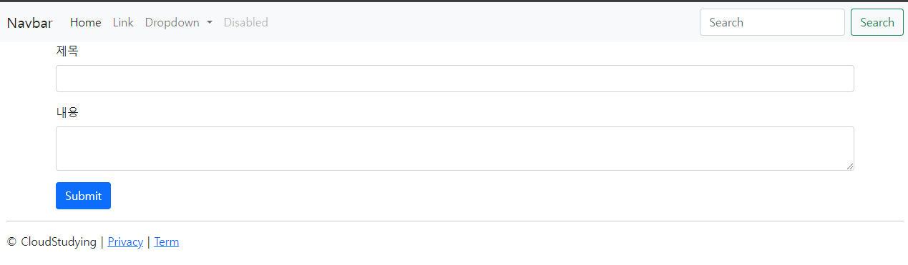

# 3. 게시판 만들고 새 글 작성하기 : Create

## 3.1 폼데이터란?

 * `폼 데이터(form data)` 란 HTML 요소인 `<form>`태그에 실려 전송 되는 데이터를 말한다
 * `<form>`태그를 이용해 어디로, 어떻게 보낼지 등을 적어 데이터를 전송한다
 * `<form>` 태그에 실어 보낸 데이터는 서버의 컨트롤러가 객체에 담아 받는다.
 * 이 객체를 `DTO` 라고 한다
 * `DTO` 로 받은 데이터는 최종적으로 데이터 베이스에 저장된다.

## 3.2 폼 데이터를 DTO로 받기
#### 1. 입력 폼 만들기
 * src > main > resources > templates에 article 디렉터리 생성
 * article 디렉터리에 new.mustache 파일 생성
  
  ```html
  <form  action="/articles/create">
    
        <input type="text" >
        <textarea ></textarea>
        <button  type="submit">Submit</button>

</form>
  ``` 
  
 * 레이아웃은 앞서 만들어 두었던 레이아웃을 사용했다
  
#### 2. 컨트롤러 만들기

 * controller 패키지에 ArticleController 생성
  ```java
  @GetMapping("articles/new")
    public String newArticleForm() {
        return "articles/new";
    }
  ```

 * 컨트롤러를 만든 후 뷰페이지를 확인해 보면
   

 * 잘 나오는 것을 확인할 수 있다
  
#### 3. 폼 데이터 전송하기
 * `<form>` 태그에 2가지 정보를 추가해 데이터를 어디로(action), 어떻게(method) 보낼지 설정한다
  ```html
    <form class="container" action="/articles/create" method="post">
  ```

#### 4. 폼 데이터 받기

 * 서버의 컨트롤러가 이 정보를 조합해 사용자가 전송 한 폼 데이터를 받아보자
  ```java
  @PostMapping("/create")
    public String createArticle(ArticleForm form) {
        System.out.println(form.toString());
        return "";
    }
  ```

#### 5. DTO만들기

 * DTO에 폼데이터를 담아 받는다
 * ArticleFrom.java
  ```java
    private String title;// 제목을 받을 필드
    private String content;// 내용을 받을 필드
  ```
 * 생성자도 추가해준다
  ```java
  public ArticleForm(String title, String content) {
        this.title = title;
        this.content = content;
    }
  ```
 * 폼 데이터를 잘 받는지 확인하기 위해 toString() 메서드도 추가해준다
    * 인텔리제이에서  `alt + ins` 를 누르면 생성자 및 toString 메서드를 만들 수 있다.
#### 6. 폼데이터를 DTO에 담기
 * 컨트롤러에 `ArticleForm` 타입의 `form` 객체를 매개변수로 선언한다
 * 폼데이터가 DTO에 잘 담겼는지 확인하기 위해 toString 메서드도 추가해 준다
  ```java
  public String createArticle(ArticleForm form) {
        System.out.println(form.toString());
  }
  ``` 

#### 7. 입력 폼과 DTO필드 연결하기
 
 * 전송한 데이터를 DTO로 받기 위해 title, content를 선언했다
 * 이 필드값이 들어가려면 입력 폼에 필드명을 지정해 주어야 한다
  ```html
  <input type="text" class="form-control" name="title">
  <textarea class="form-control" name="content"></textarea>
  ``` 
 * 이렇게 하면 입력 폼이 DTO와 연결된다.

### 정리!!

 * 뷰 페이지를 만들고 `<form>` 태그의 `action` 속성으로 데이터를 어디로 보낼지, `method` 속성으로 어떻게 보낼지 정의 한다.
 * 컨트롤러를 만들고 `PostMapping`방식으로 URL 연결
 * 전송받은 데이터를 담아둘 객체 DTO를 만든다
 * 컨트롤러에서 폼 데이터를 전송받아 DTO에 담는다

## 3.3 DTO를 데이터 베이스에 저장하기

  #### 1. `데이터베이스` 와 `JPA`
   * `JPA`란 자바 언어를 이용해 데이터를 기록해 보겠다
   * `JPA`의 핵심 도구로는 `엔티티(entity)`와 `리파지토리(repository)`가 있다
   * 내가 실습해 볼 것은 
     * 1. DTOㅔ를 엔티티로 변환하기
     * 2. 리파지터리를 이요해 엔티티를 DB에 저장하기
  #### 2. DTO를 엔티티로 변환하기
   
   * 컨트롤러에 추가
```java
Article article = form.toEntity();
``` 
 * `Article` 클래스 만들기
 * `entity` 패키지 생성 후 `Article.java` 생성
 * `@Entity` :JPA에서 제공하는 어노테이션, 이 어노테이션이 붙은 클래스 기반으로 DB테이블 생성
  ```java
    @Id // 대푯값 지정
    @GeneratedValue //시퀀스 자동 생성
    private Long Id;
    @Column // 필드 선언, 테이블의 title 열과 연결
    private String title;
    @Column // 테이블의 contet 열과 연결
    private String content;
  ```
 * 생성자와 `toString` 메서드도 만들어 준다
 * 이제 `toEntity`메서드를 추가해 DTO인 `form`객체를 엔터티 객체로 변환한다
 * ArticleForm.java
```java
public Article toEntity() {
        return new Article(null, title, content);
    }
``` 
#### 3. 리퍼지토리로 엔티티를 DB에 저장하기

 * `repository` 패키지를 만들고, `ArticleRepository` 인터페이스를 생성
  ```java
  public interface ArticleRepository extends CrudRepository<Article, Long>
  ```

 * JPA에서 제공하는 `CrudRepository`를 상속해 엔티티를 관리`(생성, 조회, 삭제, 수정)`할 수 있다
 * `CrudRepository`가 제공하는 기능을 별도 정의없이 그대로 사용할 수 있다.
 
 * 이제 컨트롤러에 리퍼지토리 객체를 선언하고 객체를 주입한다
```java
    @Autowired
    private ArticleRepository articleRepository;
     ---중략---   
    public String createArticle(ArticleForm form) {
        ---중략---
        Article saved = articleRepository.save(article);
        return "";
    }
```
 * 이때 `@Autowired` 어노테이션을 붙이면 스프링 부트가 미리 만들어 놓은 객체를 가져다 연결해준다
```java
private ArticleRepository articleRepository  = new ArticleRepositoryImpl;
```
 * 이렇게 `ArticleRepositoryImpl()` 구현체를 만들 필요가 없다는 뜻이다


  