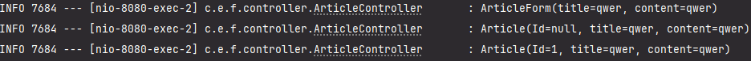

# 4. `롬복(Lombok)`과 리팩터링

**주의**
  
  * 지금 까지 책과 다른 스프링부트 3.3.4 버전을 사용해왔는데 `IllegalStateException` 예외가 발생했다.
  * 찾아보니 컨트롤러 매개변수의 이름을 해석할수 없다(?)는 의미에 예외였다
  * 어떻게 해결해야 할지 잘 몰라서 여기저기 찾아보며
  * DTO , entity 생성자에 `@ConstructorProperties({"title", "content"})`를
  * 추가해서 해결했었는데 리팩토링을 하며 해결방법을 찾지 못해 
  * 혹시 버전때문에??????라는 생각을 하며 버전을 바꾸고 빌드를 하고 실행해 보니
  * 잘된다.... 배울때는 하라는데로 하자... 버전도 잘 맞추고 ㅎㅎ

## 4.1 `롬복(Lombok)`이란?

* `롬복(Lombok)`이란 코드를 간소화 해주는 라이브러리이다.
* 개발을 하다보면 `getter()`,`setter()`등과 같은 필수 메서드를 사용하는데
* 매번 작성하기 매우 번거롭다. 
* 이런한 반복적인 작업을 없애려 나온 도구가 `롬복(Lombok)`이다.

## 4.2 롬복을 활용해 리팩터링하기

* 롬복을 이용해 코드를 간다하게 리팩터링 해보자
* 일단, 롬복을 설치 해준다
* `build.gradle` 에 의존성을 추가해 준다.
```java
    compileOnly 'org.projectlombok:lombok'
	annotationProcessor 'org.projectlombok:lombok'
```
* 이렇게 한 후 refresh를 해주면 IDE에서 추가한 코드를 감지해 롬복 관련라이브러리를 인터넷에서 자동으로 다운로드한다.(정말 편하다 학원에서 배울때는 CLI통해서 설치를 했는데 너무 복잡했다 세팅하는데 힘을 다 뺐었던... 이렇게 코드만 추가해주면 되는 스프링 부트의 위대함을 다시한번 느낀다)
  #### 1.DTO 리팩터링하기
   
   * `ArticleForm.java` 를 보면 `ArticleForm()` 생성자와 `toString()`메서드가 있다
   * 이 두가지를 삭제하고 어노테이션을 추가해 이전과 동일하게 작동하게 만들자
   * 클래스 위에 `@AllArgsConstructor` 를 추가해  준다
   * 이렇게 하면 안쪽의 모든 필드 `title`  `content` 를 매개변수로 하는 생성자가 자동으로 만들어 진다
   * 여러줄의 코드가 어노테이션 하나로 대체되는 마법...알면 알수록 신기하고 재밌다
   * 마찬가지로 `@ToString` 을 추가해 주면 `toString()` 메서드와 같은 기능을 한다
  #### 2. 엔티티 리팩터링 하기
   
   * `Article.java`도 역시  `Article()` 생성자와 `toString()`메서드가 있다
   * 이번에도 `@AllArgsConstructor`, `toString()`를 추가해주면 이전과 동일하게 작동한다
  #### 3.컨트롤러에 로그 남기기
   * 이전에는 `println()`문으로 확인하고 싶은 데이터를 출력했는데
   * 실제 서버에서는 `절대!!` 이렇게 하면 안된다.
   * `println()`문으로 데이터를 검증하면 기록에 남지 않을뿐더러 서버의 성능에도 악영향을 끼치기 때문이다
   * 로그를 남기기 위해선 로깅기능을 사용하면 되는데
   * 로깅기능을 사용하면 서버에 일어나는 모든일을 기록할 수 있다
   * `println()`문을 사용하면 나중에 따로 찾아 볼수 없지만,
   * 로깅기능을 사용하면 나중에라도 찍힌 로그를 찾아볼 수 있다
   * 컨트롤러에 `@Slf4j`어노테이션을 추가해준다
   * `println()`문을 사용한곳을 로깅으로 대체한다
  ```java
  log.info(form.toString());
        //System.out.println(form.toString());
        //1. DTO를 엔터티로 변환
        Article article = form.toEntity();
        log.info(article.toString());
        //System.out.println(article.toString());
        //2. 리파지터리로 엔터티를 DB에 저장
        Article saved = articleRepository.save(article);
        log.info(saved.toString());
        //System.out.println(saved.toString());
  ```
  * 서버를 재시작하고 내용을 입력한 후 로그를 확인해보면
  
  * 어떤데이터가 입력됐는지 데이터가 언제 저장되었는지 시간정보도 남게된다
