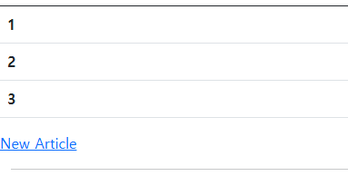
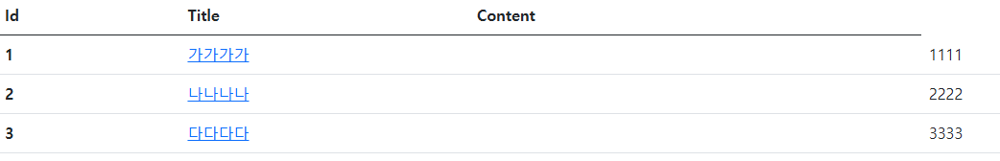

# 6. 게시판 내 페이지 이동하기

### 6.1 링크와 리다이렉트란
 
 * `링크(link)` 란 미리 정해 놓은 요청을 간편히 전송하는 기능
 * 보통 페이지 이동을 위해 사용한다.
 * HTML의 `<a>` 태그 또는 `<form>` 로 작성 가능하며, 클라이언트가 링크를 통해 어느 페이지로 이동하겠다고 요청하면 서버는 결과페이지를 응답한다.
 * 어떤 경우는 서버에서 결과 페이지를 응답하지 않고 재용청하라는 회신을 보내기도 하는데
 * 이런 경우를 `리다이렉트(redirect)`라고 한다.
 * 클라이언트가 보낸 요청을 마친 후 계속 해서 처리할 다음 요청 주소를 재지시하는 것이다.

### 6.2 링크와 리다이렉트를 이용해 페이지 연결하기
 
 * 내가 기존에 만든 서비스의 문제점
    1. 새 글을 작성하기 위한 링크가 조재하지 않는다.
    2. 새글을 작성한 후 서버에 전송하는 버튼은 있지만 목록으로 돌아가는 뒤로가기가 없다.
    3. 전반적인 페이지간 연결고리가 없다
 * `index.mustache` 파일에 추가
```HTML
<a href="/artucles/new">NEW ARTICLE</a>
```

 *  클릭하면 새 글을 작성할 수 있는 페이지로 넘어간다
 
 * 아직 `Submit` 버튼을 눌렀을 때 에러페이지가 나온다
 * 리다이렉트를 적용해 상세페이지로 넘어 갈 수 있게 해보자
* 형식 : `redirect:URL_주소`
```java
@PostMapping("/articles/create")
    public String createArticle(ArticleForm form) {
        (중략)
        Article saved = articleRepository.save(article);
    
        return "redirect:/articles/" + saved.getId();
    }
```
 * 입력페이지에서 데이터를 전송하면 컨트롤러의 createArticle() 메서드에서 데이터를 받게 되어있다
 * 리턴값에 리다이렉트를 정의해준다.`"redirect:/articles/" + saved.getId();`
 * 이렇게 해주었을 때 `getId()`메서드에 빨간색으로 표시되는데, 행당 케터 메서드가 정의 되어 있지 않다는 뜻이다
 * `Article.java`파일에 
```java
    public Long getId(){
        return id;
    }
```
 * 이런식으로 게터를 직접 만들어 줄 수도 있지만, 스프링부트에서는 롬복이 사용가능하다
 * 클래스 위에 `@Getter` 어노테이션 하나만 추가해주면 된다.
 * 이제 새글을 작성하고 `submit`버튼을 클릭하면 상세페이지로 이동이 가능하다

### H2데이터베이스 더미데이터 설정하기
 * 지금 임시로 쓰고 있는 h2는 서버를 재시작하면 DB에 있는 데이터가 다 날아간다
 * 그래서 귀찮음을 방지하기위해 더미데이터를 설정해 줄것이다.
 * src > main > resource 디렉터리에 `data.sql` 파일을 하나 만들어 준 후
```sql
insert into article(id, title, content) values(1, '가가가가', '1111')
insert into article(id, title, content) values(2, '나나나나', '2222')
insert into article(id, title, content) values(3, '다다다다', '3333')
```
* 이렇게 작성해주고 서버를 실행을 해주면 바로 되겠지 싶겠지만.
* 스프링 부트 2.5부터는 data.sql을 이용한 데이터 초기화를 권장하지 않기 때문에 
* 추가 설정이 필요하다.
* `application.properties` 파일에
* `spring.jpa.defer-datasource-initialization=true`을 추가해주고 서버를 재시작 해주면 

 * 3개의 데이터가 추가되어있다.